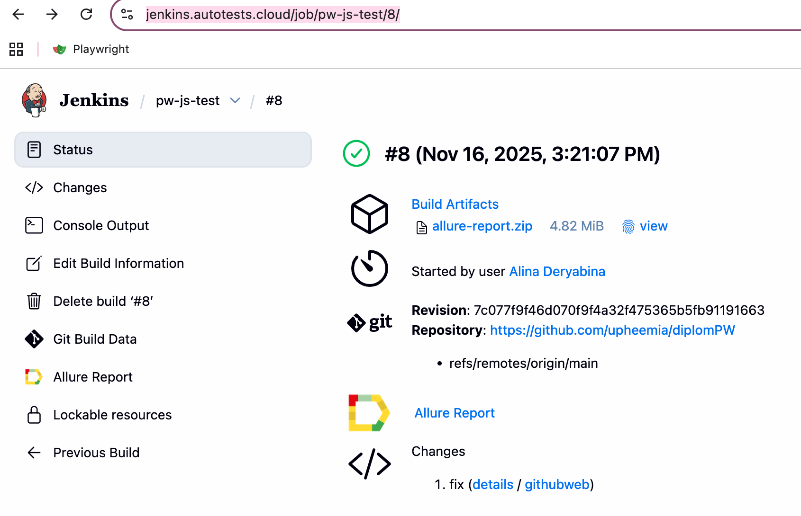
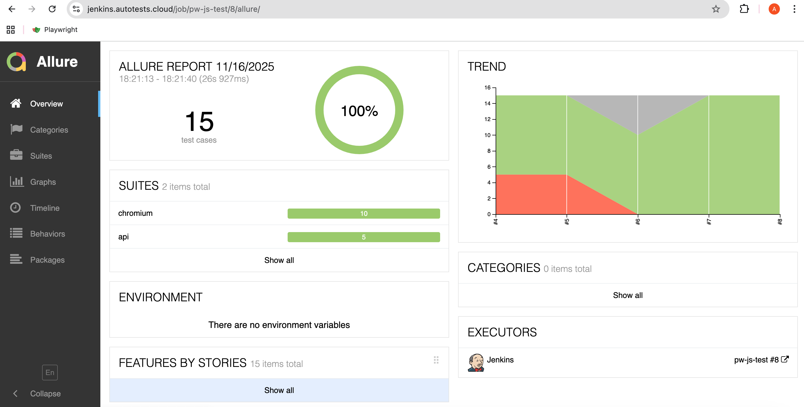
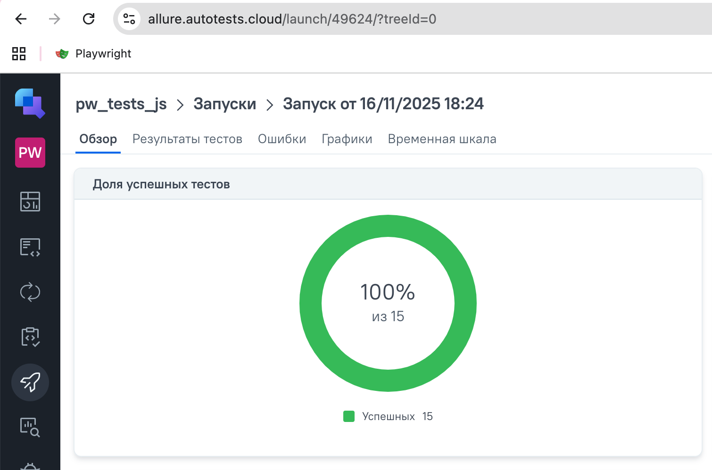
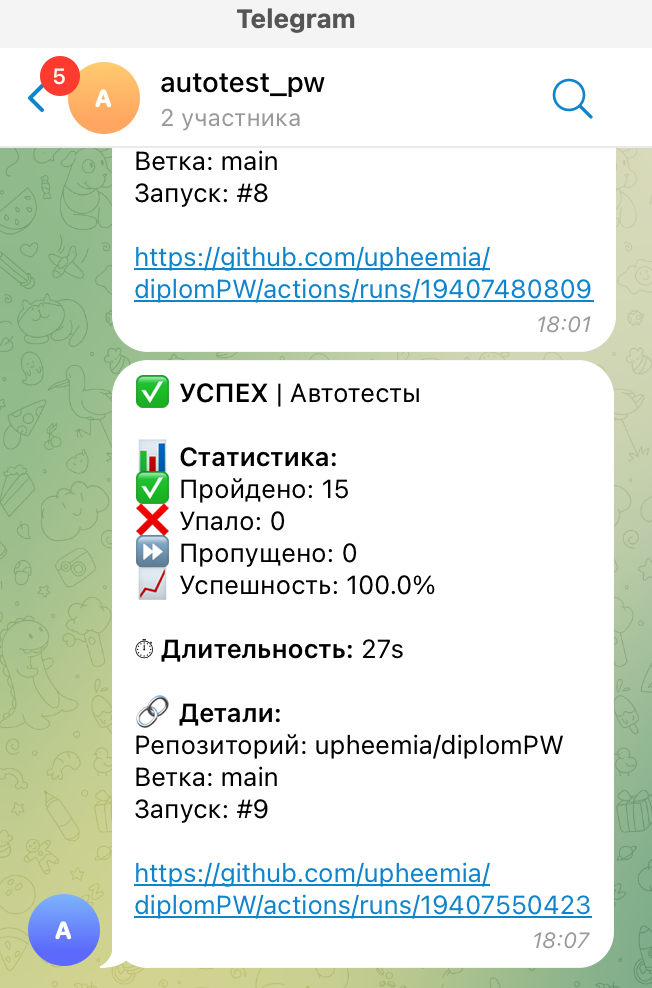

<h1 align="center">Автоматизация тестирования с использованием Playwright+js</h1>

##  Содержание:
- <a href="#cases"> Тест-кейсы</a>
- <a href="#autotests"> Запуск автотестов</a>
- <a href="#generateAllureReport"> Генерация отчетов</a>
- <a href="#jenkins"> Сборка в Jenkins</a>
- <a href="#allureReport"> Пример Allure-отчета</a>
- <a href="#allureTestOpsReport"> Пример Allure TestOps-отчета</a>
- <a href="#tg"> Уведомления в Telegram с использованием бота</a>

Тесты написаны на языке <code>JavaScript</code> с использованием фреймворка для автоматизации тестирования <code>[Playwright](https://playwright.dev)</code>.

Для удаленного запуска реализована джоба в <code>Jenkins</code>, а так же <code>Github</code> action с формированием Allure-отчета и отправкой результатов в <code>Allure TestOps</code> и <code>Telegram</code> при помощи бота.

____
<a id="cases"></a>
## 👩🏼‍💻 Тест-кейсы
### Auto:
- Регистрация нового пользователя
- Проверка неуспешной авторизации
- Отображение главной страницы
- Создание новой статьи
- Удаления статьи
- API тесты

<a id="autotests"></a>
____
## ▶️ Запуск автотестов, генерация отчетов

### Запуск тестов из терминала

Для запуска всех тестов использовать команду ниже:
```
npm test
```
Для запуска тестов по тегу API:
```
npx playwright test --project=api
```

<a id="generateAllureReport"></a>
_____
### Генерация отчетов Allure из терминала

Для генерация отчетов использовать команду ниже:
```
npm run allureFile
```

---
<a id="jenkins"></a>
## 🤖 </a> Сборка в <a target="_blank" href="https://jenkins.autotests.cloud/job/pw-js-test/8/"> Jenkins </a>
Для доступа в Jenkins необходима регистрация на ресурсе [Jenkins](https://jenkins.autotests.cloud/) 
Для запуска сборки необходимо перейти в раздел <code>Build with parameters</code>, выбрать необходимые параметры и нажать кнопку <code>Build</code>.
<p align="center">

</p>
После выполнения сборки, в блоке <code>Build History</code> напротив номера сборки появятся значки <code>Allure Report</code>, при клике на которые откроется страница с сформированным html-отчетом.

____
<a id="allureReport"></a>
## 📋 </a> Пример <a target="_blank" href="https://jenkins.autotests.cloud/job/pw-js-test/8/allure/"> Allure-отчета </a>
<p align="center">

</p>

____
<a id="allureTestOpsReport"></a>
## 📖 </a> Пример <a target="_blank" href="https://allure.autotests.cloud/launch/49624"> Allure TestOps-отчета </a>
<p align="center">

</p>

____
<a id="tg"></a>
## ☎️ Уведомления в Telegram с использованием бота
После завершения сборки, бот, созданный в <code>Telegram</code>, автоматически обрабатывает и отправляет сообщение с отчетом
о прогоне тестов в чат.
<div style="background-color: #18222d">
<p align="center">

</p>
</div>
